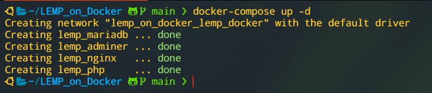
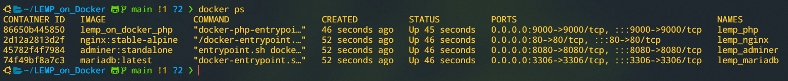
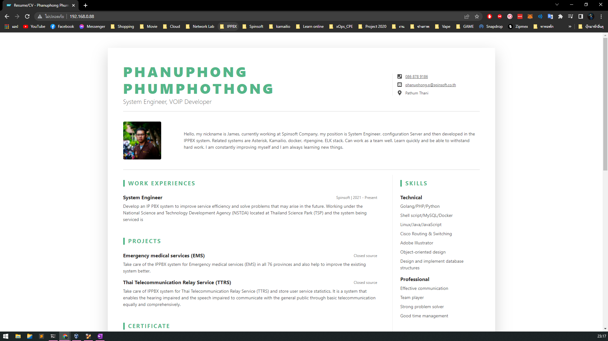

# LEMP_on_Docker
##### L = Linux operating system
##### E = Nginx web server (which replaces the Apache component of a LAMP stack)
##### M = MySQL database
##### P = dynamic content

# Use Docker Images
* nginx : stable-alpine
* mariadb : latest
* adminer : standalone
* php : 7.4-fpm-alpine

# Installation

1. **Download github**
   ``` bash
   git clone https://github.com/JameInw/LEMP_on_Docker.git
   ```
2. **Go to Directory LEMP_on_Docker**
   ``` bash
   cd LEMP_on_Docker
   ```
3. **Run Docker-compose**
   ``` bash
   docker-compose up -d
   ```
   
4. **Check Docker Process**
   ``` bash
   docker ps
   ```
   
5. **Open a web browser and enter the ip that Docker is running on.**
   
